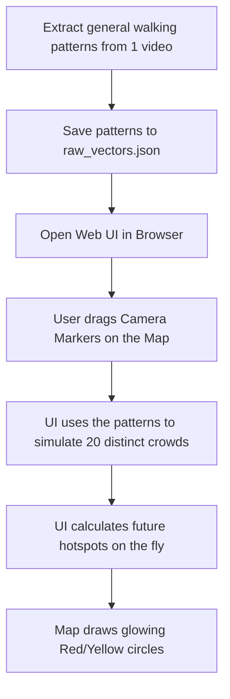

# How HotAI Works (In Simple Terms)

Welcome to the HotAI project! This document explains the technical terminologies and the overall workflow of the application in simple language.

## 📖 Simple Dictionary (Terminologies)

- **CCTV:** Standard security or traffic cameras.
- **Optical Flow (Lucas-Kanade):** A computer vision technique that compares two consecutive frames of a video to figure out which direction things are moving. 
- **Motion Vectors:** The "arrows" created by the Optical Flow. A motion vector tells us two things: **Direction** (where the object is going) and **Magnitude** (how fast it is moving).
- **DBSCAN:** A smart grouping tool. If lots of arrows are packed closely together, it forms a group (a cluster). If an arrow is all by itself, it is ignored as "noise".
- **Hotspot:** An area where DBSCAN found a dense group of moving objects. 
- **Predictive Convergence:** Instead of just looking at where people are *now*, we use math to extend their motion arrows 30-45 minutes into the future to guess where they will end up.
- **Heatmap:** A visual layer placed over the video or map. Redder/larger circles mean a higher probability of a large crowd forming.

---

## ⚙️ The Two Main Workflows

To make testing easy, HotAI is split into two separate tools: **The Video Processor** and **The UI Simulator**.

### 1. The Video Processor (Real Video Analysis)
This tool is used when you have a real video file and want to analyze it.

1. **Input:** You give the system a `.mp4` video and a GPS coordinate.
2. **Processing:** It reads the video, finds moving people, and calculates where they are heading.
3. **Output:** It generates a new `.mp4` video file with alerts drawn on the screen and saves a text file containing the exact coordinates of the hotspots.

### 2. The Web UI Simulator (Multi-Camera Testing)
Obtaining 20 videos of people walking perfectly toward the same spot is very hard. So, we built a Simulator to let you play with camera placements.

1. **The Setup:** We run a one-time script (`generate_db.py`) that watches one video, records a bunch of generic human walking patterns, and saves them to a file (`raw_vectors.json`).
2. **The Dashboard:** When you open the Web UI, it reads those patterns. It doesn't process real videos; it uses the patterns to mathematically *pretend* there are 20 cameras.
3. **The Simulation:** The UI is completely interactive. It doesn't write or save files. As you drag camera markers around the map, your web browser instantly recalculates the math and updates the predicted hotspots on the screen.

### Summary of Confusion Points Clarified
* **Why doesn't `pipeline.py` update the UI?** They are separate tools. `pipeline.py` analyzes real video files. `generate_db.py` is what generates the mock data for the UI simulator.
* **Why doesn't the UI save my camera positions?** The UI is a front-end simulator designed for instant visualization. It runs in your browser and does not talk to a backend server to overwrite files.
* **Do we need 20 videos?** No! The UI uses the extracted generic walking patterns to artificially simulate 20 distinct crowds, allowing you to test the scaling capabilities without massive video storage requirements.
