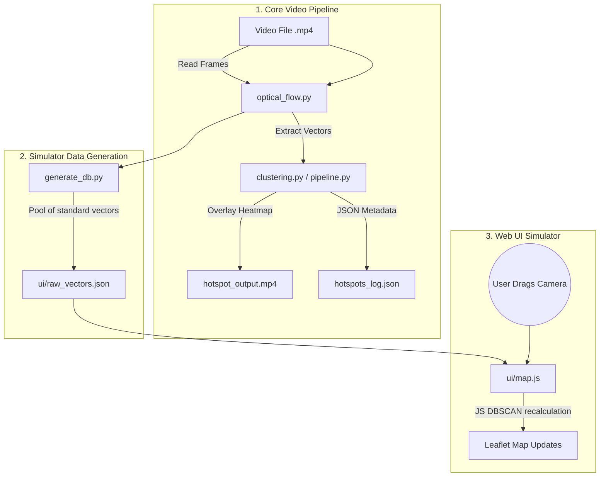

# HotAI MVP

HotAI is an intelligent video processing pipeline that detects spatial hotspots and anomalies in CCTV footage. It tracks motion vectors from pedestrians or moving objects and uses DBSCAN clustering to identify dense spots and predict future crowd convergence.

## High-Level System Architecture

The HotAI MVP is split into two distinct, loosely coupled environments. 

1. **The Core Python Pipeline**: Handles real video processing, optical flow, and static clustering.
2. **The Web UI Simulator**: An interactive environment designed to mathematically simulate multi-camera convergence without requiring 20 massive, synchronized video feeds.



## End-to-End Workflows

### Workflow 1: Single-Camera Real Video Processing
This workflow is used when you have actual CCTV footage and want to process it for hotspots.
* **Prerequisites**: An `.mp4` video file (the script will download a sample if none exists).
* **Input**: You assign a mock GPS coordinate in `src/pipeline.py`.
* **Execution**: Run `python src/pipeline.py`.
* **Component Roles**:
  * `ingestion.py`: Reads the video file frame-by-frame.
  * `optical_flow.py`: Extracts the raw motion vectors using Lucas-Kanade.
  * `clustering.py`: Clusters the motion vectors using DBSCAN and outputs projected convergence points.
  * `pipeline.py`: Orchestrates the scripts and handles drawing the heatmap onto the frames.
* **Output**: A new video (`artifacts/hotspot_output.mp4`) displaying alerts, and a JSON log (`artifacts/hotspots_log.json`) recording the coordinates.

### Workflow 2: Multi-Camera Web UI Simulation
Because sourcing 20 distinct, synchronized videos of crowds converging on a single GPS point is highly impractical for a local MVP, the Web UI serves as a **mathematical simulator**. 
* **Prerequisites**: The `ui/raw_vectors.json` file must exist.
* **Input**: Run `python src/generate_db.py`. This script extracts a "pool" of raw human movement vectors from a single sample video and saves them to the JSON file. (Note: `pipeline.py` does *not* write to this file; they are separate workflows).
* **Execution**: Open `ui/index.html` in a web browser using a local server.
* **Component Roles**:
  * `index.html` / `style.css`: The frontend dashboard layout.
  * `raw_vectors.json`: Acts as the mock "video feed" dataset.
  * `map.js`: The brains of the UI. It spawns 20 camera markers. When a user drags a camera, the UI takes the raw vectors, geometrically aligns them with the camera's new geographic position, and calculates 45-minute projections. It then runs a JavaScript version of DBSCAN completely client-side.
* **Output**: A live map that dynamically renders projected hotspots (Yellow/Orange/Red circles) without requiring a backend server or file writing.

## Setup Instructions & Prerequisites

1. Ensure Python 3.7+ is installed.
2. Install the required Python dependencies:
   ```bash
   pip install -r requirements.txt
   ```
3. To view the UI, you need a local web server (to bypass CORS restrictions when loading `raw_vectors.json`). You can use Python's built-in server:
   ```bash
   cd ui
   python -m http.server 8000
   ```
4. Open `http://localhost:8000` in your web browser.

## Known Limitations and Assumptions
* **UI Persistence**: The Web UI is a client-side simulator. It does *not* write files or persist the camera locations you drag. When you refresh the page, the cameras reset to their default circular perimeter.
* **Mock Multi-Camera Vectoring**: To guarantee a successful hotspot test case on the UI, the JS automatically rotates the vectors from the pool to point towards the center of the map.
* **Scale Factors**: The pixel-to-geographic distance conversion is mocked (e.g., assuming a specific pixel displacement roughly translates to a certain walking speed over 45 minutes). Real-world implementations would require intrinsic camera calibration parameters (extrinsic/intrinsic matrices).
